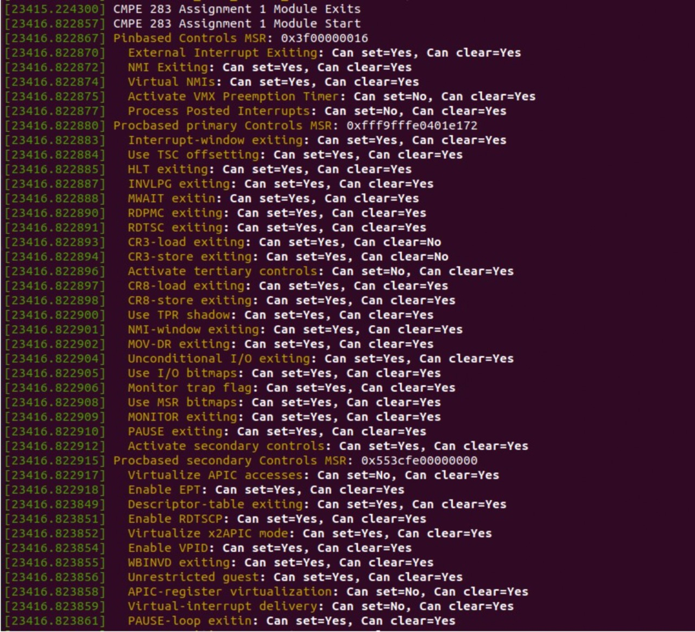

# 283project
1.Install git using command line

2.Fork the repository from torvex/linux into own repository and clone the same into local repository.

3.Now build the linux kernel code using the commands [this step will help in next assignment but not related to this assignment]

make -j [number of cpu] modules

make -j [number of cpu]

4.Now open the cmpe283-1.c file and make changes to accomodate the new controls.

5.Once it is done, we need to run make command[ Makefile should be present in the same directory].

After this we will be getting the cmpe283-1.ko file.

6.Now we need to run the command sudo insmod cmpe283-1.ko

7.Now to view the output need to run dmesg command.

The desired output will look like this.

8.Finally commit the changes to the git using

git add folderName

git commit -m "commit message"

git push
